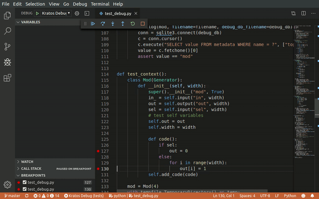

# Kratos Visual Studio Code Debugger Extension
This is a VS Code Extension for debugging hardware generated by Kratos. It
supports *step, continue, and breakpoints*.

To use it, you have to enable the debug database dump when you call
`verilog()` function in Kratos:

```Python
verilog(design, debug_db_filename="debug.db")
```
This will dump a database file called `debug.db` in your current working
directory. 

## Using Kratos VS Code Debugger Extension
* Install the *extension* in VS Code
* Compile `kratos-runtime`, which can be obtained from [here](https://github.com/Kuree/kratos-runtime).
* Start your favorite Verilog simulator:
  - For Verilator, make sure you enable ``--vpi``, put ``initialize_runtime()``
    before your test bench. For details see [here](https://github.com/Kuree/kratos-runtime/blob/master/tests/verilator/test.cc). You also need to inject
    Verilator-specific debug info as a pass before producing your design files:
    ```Python
    _kratos.passes.insert_verilator_public(design.internal_generator)
    ```
  - For `ncsim`, make sure you load the runtime library and provide entry point:
    ```Bash
    irun test_tb.sv test.sv -sv_lib libkratos-runtime.so -loadvpi libkratos-runtime.so:initialize_runtime_vpi -access +r
    ```
    
* Open your working directory where you generate the design as well as the
  debug database
* Run Debug (or press <kbd>F5</kbd>) and choose Kratos
* Enter your debug file name, e.g., `debug.db`
* You can now debug the kratos design as if debugging software!



## Using Module Viewer
Once you're in the debugging session, open the command prompt (or pressing
<kbd>F1</kbd>), then type Kratos. You will see an option of Kratos module
viewer. Once you open it, you can see the visualization of all different
modules in different hierarchy.
